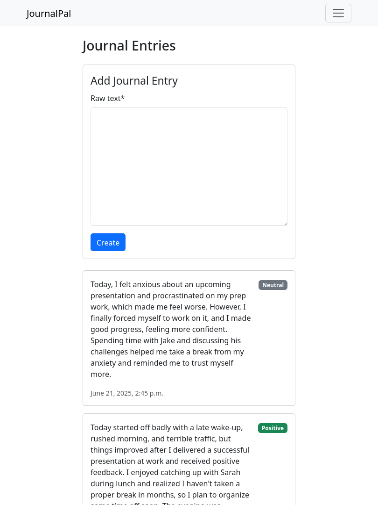

# JournalPal 
*AI-powered personal journaling*

## What it does
- Write journal entries in plain text
- AI automatically extracts mood and key themes  
- View your entries with smart insights over time

## Features
- Simple, clean interface
- OpenAI integration for sentiment analysis
- Secure authentication 
- Mobile-friendly

## Tech Stack
Django • OpenAI API • Bootstrap • Docker

## Screenshots

## Live Demo
https://journalpal.tmk.name (personal instance)
